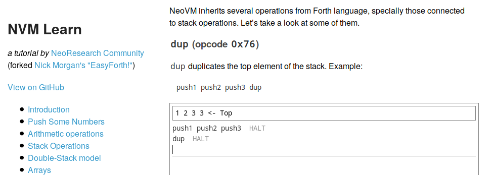

# nvm-forth
FORTH implementation of NeoVM

This is meant for experimental use only, but it is already used by [NVM Learn](https://neoresearch.io/nvm-learn) platform (see [github repository](https://github.com/neoresearch/nvm-learn)).

## License

MIT License

NeoResearch Community (2019)
